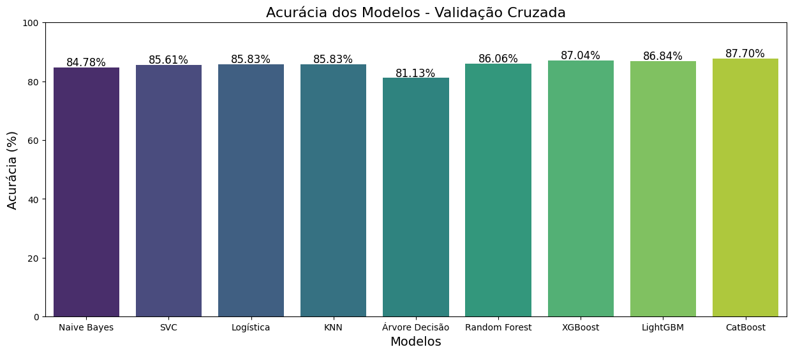
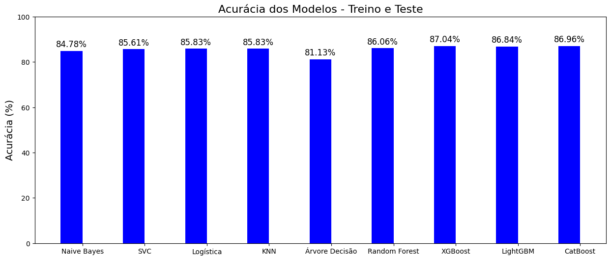
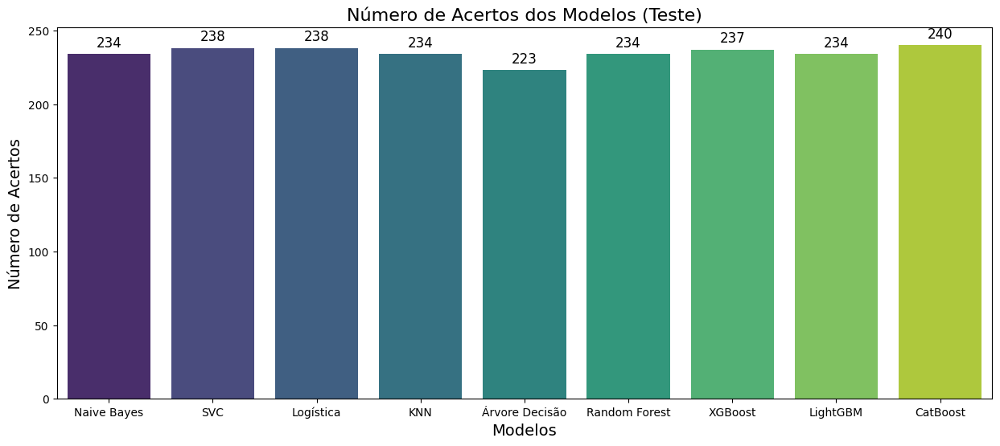

# Heart Disease ML Pipeline


Projeto completo de análise e classificação de risco de doença cardíaca utilizando o dataset Heart. Inclui exploração de dados, tratamento, redução de dimensionalidade e comparação entre modelos de machine learning, com foco especial em algoritmos de Boosting.

---

## Objetivos do projeto

A ideia central é investigar padrões que possam indicar risco de doença cardíaca em pacientes, organizar um fluxo de trabalho limpo de ciência de dados e avaliar o potencial de modelos supervisionados para apoiar a tomada de decisão.

O foco é acadêmico e computacional, não clínico. O objetivo é mostrar um pipeline bem estruturado, desde a análise dos dados até a escolha do modelo mais eficiente.

---

## Etapas do projeto

O trabalho está dividido em notebooks, cada um representando uma fase do pipeline:

1. Análise exploratória e entendimento das variáveis
2. Tratamento, limpeza e preparação dos atributos
3. Pré-processamento e redução de dimensionalidade
4. Treinamento, validação e comparação de modelos
5. Escolha do modelo final de classificação

Ao final, modelos baseados em Boosting se destacam, em especial CatBoost, que apresenta melhor desempenho na tarefa de classificação.

---

## Estrutura do repositório

```text
heart-disease-ml-pipeline/
│
├── data/
│   └── heart.csv
│
├── notebooks/
│   ├── analise_tratamento.ipynb
│   ├── exploracao_analise.ipynb
│   ├── pre_processamento_reducao_dimensionalidade.ipynb
│   ├── classificacao.ipynb
│   └── tratamento_classificacao.ipynb
│
└── figures/
    ├── eda_correlacao.png
    ├── distribuicao_variaveis.png
    ├── reducao_dimensionalidade_pca.png
    └── matriz_confusao_catboost.png
```

### Correlação entre variáveis

#### Acurácia média na validação cruzada

O gráfico abaixo compara a acurácia média dos modelos durante a validação cruzada. Ele resume o desempenho inicial e ajuda a perceber quais algoritmos se destacam antes mesmo de avaliar em teste real.



#### Acurácia em treino e teste

A seguir, temos a comparação das acurácias entre treino e teste. Esse gráfico deixa visível quando um modelo está sobreajustado ou quando consegue manter um equilíbrio saudável entre aprendizado e generalização.



#### Número de acertos no conjunto de teste

Aqui estão os acertos absolutos de cada modelo. É uma forma simples de enxergar impacto direto na classificação prática, mostrando quantas previsões corretas cada um realmente fez.



---

## Tecnologias utilizadas

Python
Pandas
NumPy
Scikit-Learn
CatBoost
LightGBM
XGBoost
Matplotlib
Seaborn
Plotly Express
Jupyter Notebook

---

## Como executar

1. Clone este repositório

```bash
git clone https://github.com/seu-usuario/heart-disease-ml-pipeline.git
cd heart-disease-ml-pipeline
```

2. Crie e ative um ambiente virtual (opcional, mas recomendado)

```bash
python -m venv .venv
# Windows
.venv\Scripts\activate
# Linux/macOS
source .venv/bin/activate
```

3. Instale as dependências

```bash
pip install -r requirements.txt
```

4. Abra os notebooks

```bash
jupyter notebook
```

Recomenda-se seguir a sequência de execução de acordo com os nomes dos arquivos, começando por análise e tratamento e finalizando com classificação.

---

## Aviso importante

Este projeto tem caráter exclusivamente educacional e experimental.
Os resultados não devem ser utilizados para diagnóstico, decisão clínica ou qualquer finalidade médica real.

---

## Contribuições

Sugestões de melhoria são bem-vindas.
Você pode:

* abrir uma issue com ideias de novas análises
* propor novos modelos ou técnicas de validação
* enviar um pull request com ajustes de código, documentação ou visualizações

---

## Licença

Este projeto está licenciado sob a licença MIT.
Sinta-se à vontade para usar o código como base para estudos, experimentos ou portfólio.
